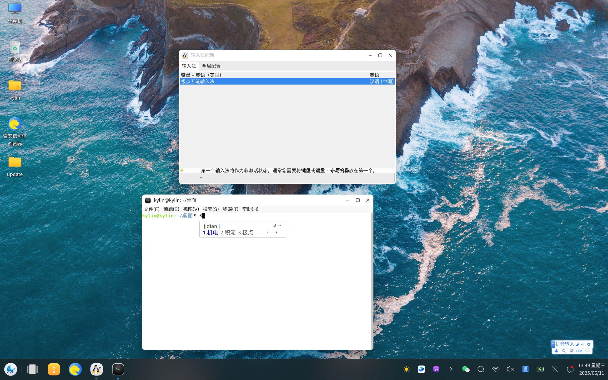
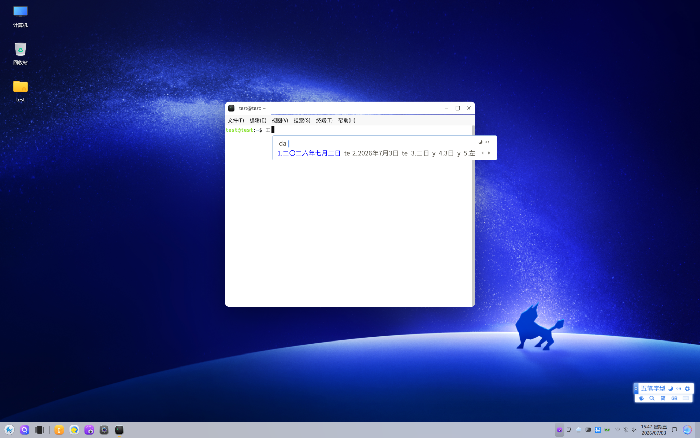

# 极点五笔输入法
## 介绍
极点五笔输入法，全称为“极点中文汉字输入平台”，是由杜志民先生在21世纪之初开发的一款完全免费且功能强大的输入法。  

极点五笔输入法以五笔输入为主，拼音输入为辅，支持智能造词、字典功能以及命令操作等。自诞生以来，极点五笔输入法凭借其高效、稳定的输入体验，赢得了广大中文用户的喜爱。杜志民先生作为这一优秀软件的创造者，一直致力于为用户提供更加便捷、智能的输入解决方案。

目前，极点五笔输入法由openKylin Input Method SIG和杜志民先生共同开发维护。

## 编译安装
### 1. 配置编译环境
```bash
### 编译fcitx输入法框架版本
sudo apt install g++ cmake fcitx-libs-dev libgl1-mesa-dev libglu1-mesa-dev libxi-dev libxtst-dev libdbus-1-dev qtbase5-dev libqt5svg5-dev extra-cmake-modules libspdlog-dev

### 编译fcitx5输入法框架版本
sudo apt install g++ cmake libfcitx5core-dev libxi-dev libxtst-dev libdbus-1-dev libsystemd-dev qtbase5-dev libqt5svg5-dev extra-cmake-modules libspdlog-dev libwayland-dev

### 编译ibus输入法框架版本
sudo apt install g++ cmake libibus-1.0-dev libxi-dev libxtst-dev libdbus-1-dev libsystemd-dev qtbase5-dev libqt5svg5-dev extra-cmake-modules libspdlog-dev libwayland-dev
```
### 2. 编译源码
```bash
git clone https://gitee.com/openkylin/freewb.git

cd freewb
mkdir build && cd build

## 编译fcitx4输入法插件
cmake .. -DCMAKE_INSTALL_PREFIX=/usr -DCMAKE_INSTALL_LIBDIR=lib/x86_64-linux-gnu -DENABLE_FCITX4=On

## 编译fcitx5输入法插件
cmake .. -DCMAKE_INSTALL_PREFIX=/usr -DCMAKE_INSTALL_LIBDIR=lib/x86_64-linux-gnu -DENABLE_FCITX5=On

## 编译ibus输入法插件  
cmake .. -DCMAKE_INSTALL_PREFIX=/usr -DCMAKE_INSTALL_LIBDIR=lib/x86_64-linux-gnu -DENABLE_IBUS=On

make -j4
sudo make install
```

### 3. fcitx添加极点五笔输入法
```kylin v10```

```kylin v11```


### 4. 重新启动输入法框架

