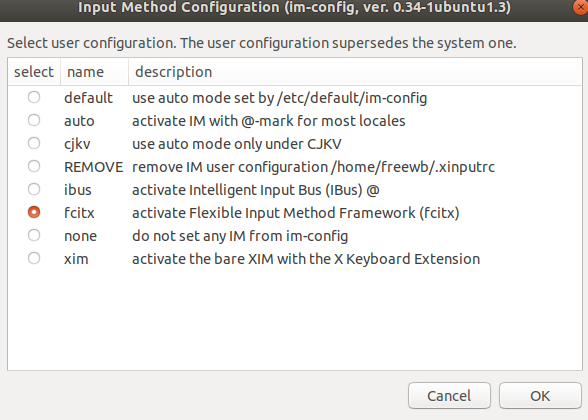
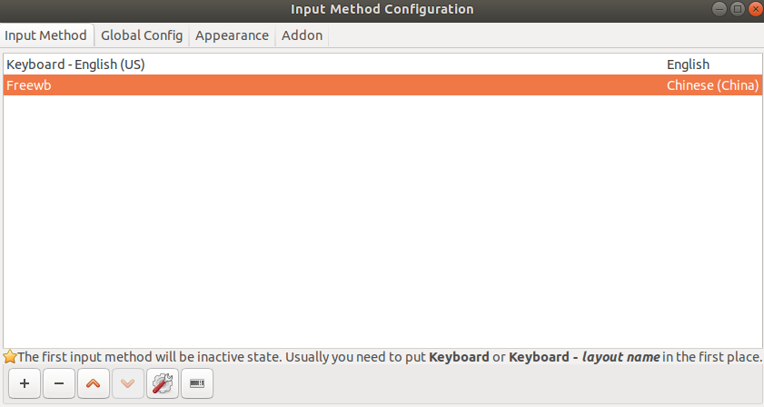

# Freewb安装说明
## 1. 配置编译环境
```bash
## 安装基础依赖
sudo apt install g++ cmake fcitx-libs-dev libgl1-mesa-dev libglu1-mesa-dev libxi-dev libxtst-dev libdbus-1-dev qtbase5-dev

####if can't install above then
sudo apt --fix-broken install


####统信1020下编译qt5.12.3时，需要编译xcb，开始configure之前需安装以下包
1、sudo apt install libfontconfig1-dev libfreetype6-dev libx11-dev libx11-xcb-dev libxext-dev libxfixes-dev libxi-dev libxrender-dev libxcb1-dev libxcb-glx0-dev libxcb-keysyms1-dev libxcb-image0-dev libxcb-shm0-dev libxcb-icccm4-dev libxcb-sync0-dev libxcb-xfixes0-dev libxcb-shape0-dev libxcb-randr0-dev libxcb-render-util0-dev libxcb-xinerama0-dev libxkbcommon-dev libxkbcommon-x11-dev
2、sudo apt install libpcre2-dev
支持pcre2


## 下载qt5.12.3
wget https://download.qt.io/archive/qt/5.12/5.12.3/qt-opensource-linux-x64-5.12.3.run
sudo chmod +x qt-opensource-linux-x64-5.12.3.run
sudo ./qt-opensource-linux-x64-5.12.3.run
### NOTE: 安装路径选为/opt并勾选Qt5.12.3

## 配置qt5.12.3环境变量
export PATH=$PATH:/opt/Qt5.12.3/5.12.3/gcc_64/bin
sudo vi /usr/lib/`arch`-linux-gnu/qt-default/qtchooser/default.conf
### NOTE: 第一行改为"/opt/Qt5.12.3/5.12.3/gcc_64/bin"


##重要：需要编辑/freewb-deb-master/src/panel/CMakeLists.txt
set( CMAKE_BUILD_TYPE Release ) #Debug or Release下添加如下两行
set(QT_PATH "/opt/qt5.12.3/aarch64"  CACHE PATH "qt5 cmake dir")
set(CMAKE_PREFIX_PATH ${QT_PATH})

### 检验
qmake -v
### 应输出"Using Qt version 5.12.3 in /opt/Qt5.12.3/5.12.3/gcc_64/lib"
```
## 2. 编译freewb源码
```bash
mkdir build
cd build
cmake ..
make
sudo make install
```

## 3. 放置码表
```bash
## 创建码表文件夹
sudo mkdir -p /usr/share/freewb/data/mb/default
cp ${码表文件} /usr/share/freewb/data/mb/default/
```

## 4. 输入法选择fcitx并重启

搜索Input Method并选择fcitx



重启
```bash
sudo reboot
```

## 5. fcitx添加freewb输入法

搜索Fcitx Configuration，添加freewb输入法



